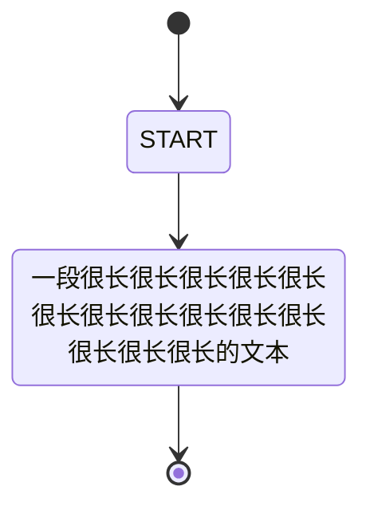
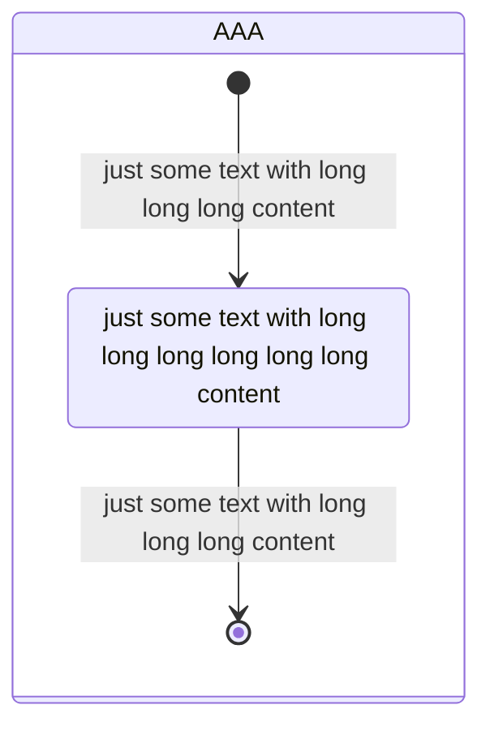
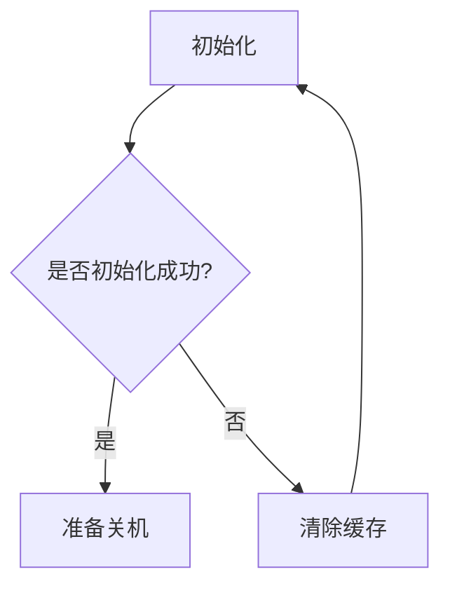

# This is the first topic

```mermaid
stateDiagram-v2
    [*] --> START
    CHOOSE: 一段很长很长很长很长很长很长很长很长很长很长很长很长很长很长的文本
    START --> CHOOSE
    CHOOSE --> [*]
```

```mermaid
stateDiagram-v2
    state AAA {
        [*] --> B: just some text with long long long content
        B: just some text with long long long long long long content
        B --> [*]: just some text with long long long content
    }
```

```plantuml
@startuml
    A -> B
    B --> C
@enduml

@startgantt
[Prototype design] requires 15 days
[Test prototype] requires 10 days
-- All example --
[Task 1 (1 day)] requires 1 day
[T2 (5 days)] requires 5 days
[T3 (1 week)] requires 1 week
[T4 (1 week and 4 days)] requires 1 week and 4 days
[T5 (2 weeks)] requires 2 weeks
@endgantt
```

Preview:

```mermaid
graph TD;
    A[初始化] --> B{是否初始化成功?}
    B -->|是| C[准备关机]
    B -->|否| D[清除缓存]
    D --> A
```